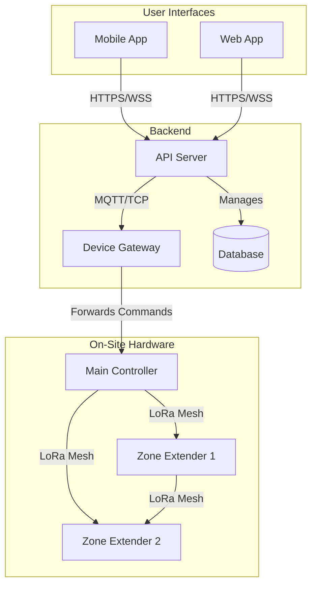

# Azul Sprinkler System: Overall Architecture

**Date:** May 2, 2026

## 1. High-Level Overview

The Azul Sprinkler System is a comprehensive irrigation control ecosystem designed for flexibility, resilience, and remote management. It consists of user-facing applications (mobile and web), a central backend server, and a network of intelligent hardware controllers. The system is architected to support both directly wired zones and wireless, battery-operated "Zone Extenders" for areas without existing infrastructure, all managed through a unified interface.

## 2. Core Components

### 2.1 User Interfaces

#### a. Mobile App (React Native)
- **Platform:** iOS & Android (via Expo).
- **Purpose:** Primary interface for homeowners to manage schedules, view water usage, receive alerts, and manually control zones.
- **Key Features:**
    - Real-time status of all zones.
    - Push notifications for alerts (e.g., connectivity loss, low battery).
    - Local Bluetooth (LE) connection for on-site diagnostics of Zone Extenders.
    - Secure authentication and user management.

#### b. Web App (Browser-Based)
- **Platform:** Any modern web browser.
- **Purpose:** A comprehensive dashboard for system configuration, historical data analysis, and management. Geared towards both homeowners and professional landscapers.
- **Key Features:**
    - Detailed analytics and water usage reports.
    - Advanced schedule creation and management.
    - System-wide configuration and device management.
    - User role and permission management.

### 2.2 Backend Services (Server-Side)

- **Purpose:** The central brain of the Azul system. It handles all business logic, data persistence, and communication orchestration between user interfaces and hardware.
- **Responsibilities:**
    - **API Server:** Provides a secure RESTful or GraphQL API for the mobile and web apps.
    - **Device Gateway:** Manages communication with the Main Controller, queuing commands and processing incoming data.
    - **Authentication & Authorization:** Securely manages user accounts and permissions.
    - **Database:** Stores user data, schedules, device status, and historical usage logs.
    - **Notification Service:** Dispatches alerts (push notifications, emails) based on system events.

### 2.3 Hardware Controllers

#### a. Main Controller
- **Connectivity:** Wi-Fi or Ethernet for direct communication with the backend server.
- **Function:** The primary on-site hub. It directly controls standard, low-voltage wired irrigation zones.
- **LoRa Gateway:** Acts as the master gateway for the LoRa mesh network, relaying commands and data between the backend and the Zone Extenders.
- **Power:** Mains-powered (AC).

#### b. Zone Extenders
- **Connectivity:** LoRa (915MHz) mesh network for communication with the Main Controller or other mesh nodes. Bluetooth 5.0 (LE) for local diagnostics.
- **Function:** A battery-operated, IP68-rated controller for DC latching solenoids. Designed for autonomous operation in remote or flood-prone areas.
- **Key Features:**
    - **Autonomous Operation:** Stores and executes schedules locally, ensuring operation even if the LoRa link is lost.
    - **Ultra-Low Power:** Utilizes deep sleep modes to achieve a multi-year battery life.
    - **Wireless Charging:** Sealed design with Qi wireless charging to maintain waterproof integrity.
    - **Resilient:** Housed in a fully submersible IP68 enclosure.

## 3. Communication Protocols

- **User App ↔ Backend:** Secure HTTPS/WSS for all API calls and real-time updates.
- **Backend ↔ Main Controller:** Secure MQTT or a custom TCP protocol over the local network/internet for persistent, real-time communication.
- **Main Controller ↔ Zone Extenders:** A custom LoRa mesh network protocol. This ensures long-range, low-power, and reliable communication that can route around obstacles. The protocol includes encryption (AES-128) to secure communication.

## 4. High-Level Data Flow Example: *User Manually Activates a Remote Zone*

1.  **User Action:** The user taps a button in the mobile app to turn on "Zone 5," which is controlled by a Zone Extender.
2.  **API Call:** The mobile app sends a secure command (`startZone: { zoneId: 5, duration: 10 }`) to the Backend Server via HTTPS.
3.  **Command Queuing:** The Backend authenticates the request and forwards the command to the Main Controller via MQTT.
4.  **LoRa Transmission:** The Main Controller's LoRa Gateway transmits the encrypted command over the mesh network. It may be routed through other nodes to reach the target Zone Extender.
5.  **Device Action:** The Zone Extender wakes up, receives and decrypts the command, and activates its H-Bridge to open the DC latching solenoid.
6.  **Acknowledgement:** The Zone Extender sends an acknowledgement message back through the LoRa mesh, confirming the action.
7.  **Status Update:** The acknowledgement travels back to the Main Controller, which forwards it to the Backend.
8.  **UI Feedback:** The Backend pushes a real-time status update to the mobile and web apps, showing that "Zone 5" is now active.

## 5. Architecture Diagram

*(Placeholder for a visual diagram, e.g., a Mermaid or PlantUML chart, showing the relationships between these components.)*

