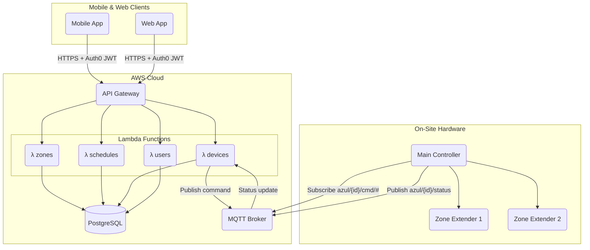

# Cloud & API Architecture

**Scope:** Backend cloud services for the Azul ecosystem — API design, database, authentication, device communication, and infrastructure management.

---

## 1. Technology Stack

| Concern | Development | Production |
|---|---|---|
| Language | TypeScript | TypeScript |
| Runtime | Node.js | Node.js |
| Framework | Express.js | Express.js |
| API | AWS Lambda + API Gateway | AWS Lambda + API Gateway |
| Database | Neon (serverless Postgres, free tier) | AWS RDS PostgreSQL |
| ORM | Prisma | Prisma |
| MQTT Broker | HiveMQ Cloud (free tier) | AWS IoT Core |
| Auth | Auth0 | Auth0 |
| IaC | Terraform | Terraform |

---

## 2. Infrastructure Strategy

### 2.1. Development: Zero-Cost Stack

During development use free-tier managed services to avoid AWS instance costs:

- **Neon** — serverless Postgres, free tier, no instance to stop/start
- **HiveMQ Cloud** — managed MQTT, free tier (10 connections, 10GB/month)
- **Lambda + API Gateway** — serverless, pay-per-request (~free at dev scale)
- **Auth0** — existing tenant, free tier

### 2.2. Terraform for Infrastructure as Code

All infrastructure is defined in Terraform. Spin up and tear down on demand:

```bash
# Start a dev session
cd server/infra
terraform apply

# Tear down when done (stops billing)
terraform destroy
```

**Proposed Terraform module structure:**
```
server/
  infra/
    main.tf           # Provider config, shared locals
    lambda.tf         # Lambda functions + API Gateway
    database.tf       # RDS (prod) or Neon data source (dev)
    mqtt.tf           # AWS IoT Core (prod) or HiveMQ config (dev)
    auth.tf           # Auth0 Terraform provider config
    variables.tf      # env = "dev" | "prod"
    outputs.tf        # API URL, MQTT endpoint, DB connection string
```

Switch between dev and prod with a single variable:
```bash
terraform apply -var="env=dev"   # uses Neon + HiveMQ
terraform apply -var="env=prod"  # uses RDS + IoT Core
```

### 2.3. Cost Profile

| Service | Dev cost | Prod cost (est.) |
|---|---|---|
| Lambda + API GW | ~$0 | ~$5-20/mo |
| Database | $0 (Neon free) | ~$15-30/mo (RDS t3.micro) |
| MQTT | $0 (HiveMQ free) | ~$5-15/mo (IoT Core) |
| Auth0 | $0 (free tier) | $0-23/mo |
| **Total** | **$0** | **~$25-70/mo** |

---

## 3. System Architecture



---

## 4. MQTT Device Protocol

Device topic namespace: `azul/{device_mac}/`

### 4.1. Device → Cloud (publish)

| Topic | Payload | Description |
|---|---|---|
| `azul/{mac}/status` | JSON status object | Published every 60s and on state change |
| `azul/{mac}/events` | JSON event object | Zone start/stop, schedule change, boot |
| `azul/{mac}/log` | JSON log entry | Audit log entries |

### 4.2. Cloud → Device (subscribe)

| Topic | Payload | Description |
|---|---|---|
| `azul/{mac}/cmd/zone/start` | `{"zone":1,"duration":60}` | Start a zone |
| `azul/{mac}/cmd/zone/stop` | `{"zone":1}` | Stop a zone |
| `azul/{mac}/cmd/zone/stop-all` | `{}` | Stop all zones |
| `azul/{mac}/cmd/schedule/set` | Schedule JSON | Push a new schedule |
| `azul/{mac}/cmd/schedule/activate` | `{"uuid":"..."}` | Activate a schedule |
| `azul/{mac}/cmd/time/set` | `{"tz_offset":-25200,"tz_name":"..."}` | Set timezone |
| `azul/{mac}/cmd/reboot` | `{}` | Reboot device |

### 4.3. Status Payload

```json
{
  "firmware": "0.2.0-abc1234",
  "uptime": 3600,
  "ip": "192.168.1.183",
  "mac": "AC:A7:04:26:60:D0",
  "ntp_synced": true,
  "datetime": "2026-05-08T11:30:00-07:00",
  "temperature_c": 42.1,
  "zones_running": false,
  "active_schedule_uuid": "ed3dff10-...",
  "ram_free": 168604,
  "ram_total": 324308
}
```

---

## 5. API Specification

### 5.1. REST Endpoints (mobile/web → backend)

Authentication: Auth0 JWT on all endpoints.

| Method | Path | Description |
|---|---|---|
| GET | `/api/devices` | List user's controllers |
| GET | `/api/devices/:id` | Device status (proxied from MQTT last-will) |
| POST | `/api/devices/:id/zones/:zoneId/start` | Start a zone remotely |
| POST | `/api/devices/:id/zones/stop-all` | Stop all zones remotely |
| GET | `/api/devices/:id/schedules` | List schedules for a device |
| POST | `/api/devices/:id/schedules` | Create and push schedule to device |
| PUT | `/api/devices/:id/schedules/:scheduleId/activate` | Activate a schedule |
| GET | `/api/devices/:id/log` | Audit log |

### 5.2. Authentication

- Mobile and web clients authenticate with Auth0 (existing tenant)
- JWTs validated at API Gateway level (Lambda authorizer)
- Device-to-cloud MQTT uses per-device certificates or API keys (not Auth0)

---

## 6. Database Schema (high-level)

```
users          id, auth0_sub, email, name, created_at
devices        id, user_id, mac, name, firmware, last_seen, ip
zones          id, device_id, zone_number, name
schedules      id, device_id, uuid, name, start_date, end_date, runs (JSONB)
audit_log      id, device_id, zone_id, started_at, duration_sec, source
```

*(Full ERD: see [system-data-architecture.md](system-data-architecture.md))*

---

## 7. Multi-Tenant Architecture (Landscaper Support)

Azul supports two personas beyond the basic homeowner:

- **Landscaper** — manages irrigation for multiple client properties
- **Customer** — a homeowner whose system is managed by a landscaper

### 7.1. Account Model

```
Account types (stored on users table):
  owner       Standard homeowner. Sees only their own controllers.
  landscaper  Sees their own controllers + all client controllers.
  customer    Sees their own controllers. May be linked to a landscaper.
```

### 7.2. Relationship Model

```
organizations   id, name, owner_id (landscaper's user_id)
org_members     org_id, user_id, role (admin | member)
devices         id, owner_user_id, org_id (nullable)
```

A device owned by a customer can be associated with a landscaper's `org_id`, granting the landscaper full management access. The customer retains ownership and can see/revoke access.

### 7.3. Auth0 Organizations

Auth0 supports native Organizations — each landscaper business maps to one Auth0 Org. Customers are members of that org. This gives:
- SSO within a landscaper's customer portal
- Per-org branding (logo, colors) for white-label
- Role claims in JWTs (`org_id`, `role`)

### 7.4. API Authorization Rules

| Actor | Can access |
|---|---|
| Owner | Their own devices |
| Customer | Their own devices |
| Landscaper (org admin) | All devices in their org |
| Landscaper member | Devices in their org, read-only |

All enforcement happens in Lambda authorizers — no client-side trust.

---

## 8. Communication Architecture

The backend acts as a **command bus** between web/mobile clients and controllers. BLE (direct) and cloud (via MQTT) are parallel paths:

```
Web App  ──HTTPS──▶ API Gateway ──MQTT publish──▶ Controller
Mobile   ──BLE (direct, in range)───────────────▶ Controller
Mobile   ──HTTPS──▶ API Gateway ──MQTT publish──▶ Controller (remote)
```

**Key principle:** The controller is the source of truth. The backend syncs state from the controller (via MQTT status messages) and writes commands to it (via MQTT command topics). The backend never assumes a command succeeded — it waits for the controller to publish a confirming status update.

### 8.1. Controller Cloud Registration

When a controller first gets WiFi credentials (via BLE `set_wifi`), it should:
1. Connect to MQTT broker using a pre-provisioned device certificate or rotating API key
2. Publish `azul/{mac}/online` with firmware version and capabilities
3. Subscribe to `azul/{mac}/cmd/#`
4. Begin periodic `azul/{mac}/status` heartbeats (60s)

The backend persists the last-seen status and marks the device offline if no heartbeat for 5 minutes.

---

## 9. Web Application

See [web-app-architecture.md](web-app-architecture.md) for full detail.

**Summary:** A Next.js app hosted on Vercel (or AWS Amplify) that mirrors the mobile app's functionality. Auth0 for login. Communicates exclusively through the backend API — no direct BLE or device access.

---

## 10. Implementation Order (Updated)

1. **Dev infrastructure** — Terraform with Neon + HiveMQ + Lambda skeleton
2. **Device registration** — controller publishes online/status via MQTT; backend persists
3. **Zone control** — cloud → device MQTT commands; backend confirms via status update
4. **Schedule sync** — backend pushes schedules to device on connect and on change
5. **Auth0 integration** — JWT validation, user record creation on first login
6. **Audit log** — controller publishes events; backend aggregates
7. **Multi-tenant** — org model, landscaper/customer roles, Auth0 Organizations
8. **Web app** — Next.js frontend consuming the backend API
9. **Prod infrastructure** — RDS + IoT Core when approaching launch
