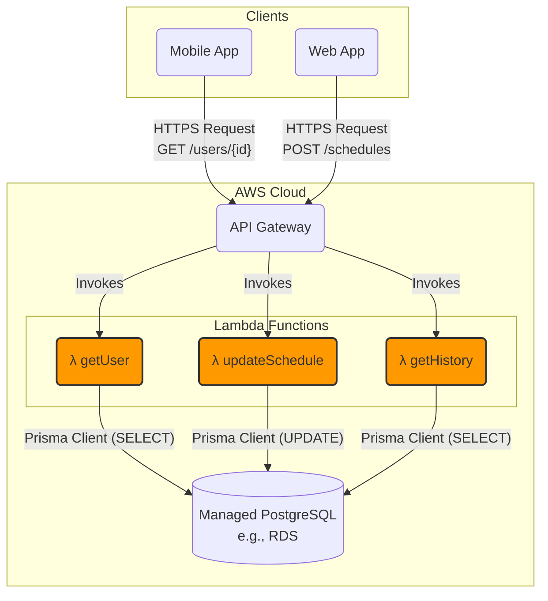

# 3. Cloud & API Architecture

**Scope:** This document specifies the architecture for the backend cloud services that power the Azul ecosystem. It covers the API design, database schema, authentication mechanisms, and communication protocols for interacting with both mobile clients and hardware controllers.

---

## 1. Cloud & API Architecture

### 1.1. Technology Stack

-   **Language:** **TypeScript**
-   **Runtime:** **Node.js**
-   **Framework:** **Express.js**
-   **Database:** **PostgreSQL** (via a managed service like AWS RDS or Google Cloud SQL).
-   **Database ORM:** **Prisma**
-   **Deployment Model:** **Serverless** (e.g., Vercel, AWS Lambda with API Gateway)

### 1.2. High-Level System Diagram

This diagram illustrates the request lifecycle for a typical API call in the serverless architecture.

---

## 2. Architectural Decisions: Backend

### 2.1. API Implementation: Serverless Functions

The REST API will be implemented using a serverless function architecture, combining a managed API gateway with on-demand compute, as illustrated in the diagram above.

-   **Mechanism (AWS Example):**
    1.  **API Gateway:** This service acts as the public "front door." It is configured with the API routes (e.g., `POST /schedules`) and is responsible for handling web traffic, authentication, caching, and throttling.
    2.  **AWS Lambda:** Each API route is mapped to a specific Lambda function containing the business logic. When an authenticated request arrives, API Gateway invokes the corresponding function, passing it the request data. The Lambda function executes its logic (e.g., uses Prisma to query the database) and returns a response.

-   **Performance & Scalability:** This model is extremely performant and scalable due to its massive parallelization capabilities. If 10,000 users make a request simultaneously, the platform simply executes 10,000 parallel instances of the function.

-   **Cold Starts:** A known trade-off is the "cold start," where the first request to an idle function incurs a small latency (typically <1 second) as the container is initialized. This is a manageable issue that can be mitigated with "provisioned concurrency" for critical endpoints if necessary. For the majority of use cases, the benefits of automatic scaling far outweigh the impact of infrequent cold starts.

### 2.2. Database Technology: PostgreSQL (Managed)

-   **Executive Recommendation:** PostgreSQL is the definitive choice, delivered via a managed service.
-   **Justification:**
    -   **Relational Integrity:** Perfectly matches the normalized Azul data model.
    -   **Hybrid Power:** The `JSONB` data type provides critical flexibility for storing complex schedule data while allowing for high-performance indexing.
    -   **Managed Scalability:** Provides one-click vertical and horizontal (read-replica) scaling, plus automated backups and maintenance.

---

## 3. API Specification
- 3.1. RESTful API Endpoints
- 3.2. Real-time Communication (WebSockets / MQTT)
- 3.3. Authentication & Authorization (Auth0/JWT)

## 4. Database Schema
*(For a detailed ERD and attribute list, see the [System Data Architecture](system-data-architecture.md) document).*

## 5. Hardware Communication Gateway
- 5.1. Protocol Definition (Controller <-> Cloud)
- 5.2. Device State Management
