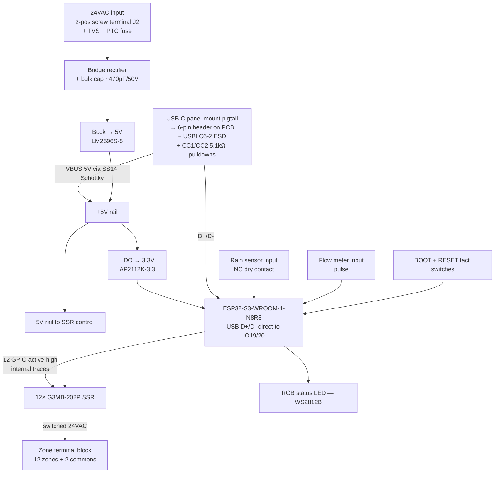
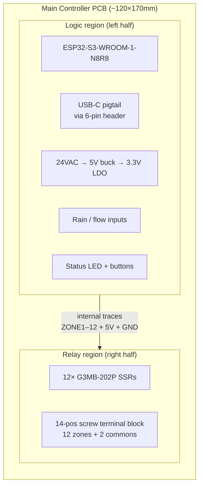

# Main Controller PCB v1 — Design Spec

First custom PCB to replace the ESP32-S3-DevKitC-1 + breadboard prototype. Goal is a manufacturable two-board set that can run a real 12-zone irrigation system in a wall-mount enclosure.

## Scope and non-goals

**In scope (v1):**
- 12 zones, 24VAC switching via SSR
- ESP32-S3-WROOM-1-N8R8 hosted directly (no DevKitC daughterboard)
- Native USB over USB-C via **panel-mount pigtail + on-PCB 6-pin header** (no PCB-edge USB-C receptacle, no USB-to-UART chip)
- Rain sensor and flow meter inputs
- Single-board architecture housing logic + relay sections, sized for Polycase WC-25F enclosure

**Out of scope (deferred):**
- LoRa (SX1262) — reserved for the future in-ground waterproof zone-extender product, see `zone-extender-spec.md`
- Battery / RTC backup
- Ethernet
- Display

## Locked design decisions (2026-06-30)

| Decision | Choice | Rationale |
|---|---|---|
| MCU package | ESP32-S3-WROOM-1-N8R8 module | Pre-certified, antenna integrated, no RF layout work |
| USB | Native USB direct to GPIO19/20; enclosure-side USB-C via **waterproof panel-mount pigtail** wired to a **6-pin 2.0mm header on PCB** (VBUS/GND/D+/D−/CC1/CC2) — no PCB-edge USB-C receptacle | Rev1 placed the SMT USB-C receptacle facing inward and un-pluggable; rev2 removes it entirely. Pigtail keeps enclosure IP-rated, moves cable-yank load onto the enclosure wall, and eliminates PCB-edge fine-pitch soldering. |
| Power input | 24VAC via **2-pos screw terminal (J2) on PCB** — accepts pigtail from any source (panel-mount barrel jack, hardwired transformer, direct wall wart) | Decouples PCB design from enclosure/connector choice; panel-mount barrel jack chosen alongside enclosure selection |
| Power chain | Bridge rectifier → buck to 5V → LDO to 3.3V | Bulk caps absorb 24VAC ripple; buck handles the 30+ V peak |
| Zone switching | 12× G3MB-202P SSR | Same part as PoC; triac alternative adds layout complexity for marginal savings |
| Sensor inputs | Rain (NC dry contact) + flow (pulse) | Cheap to add now, painful to retrofit |
| Architecture | Single board (~120×170mm) with logic + relay regions | Simpler assembly; 4 corner mount to native enclosure bosses; no ribbon connector; split-board optimization deferred to rev3+ |
| Enclosure | Polycase WC-25F (222×146×55mm, clear polycarbonate, NEMA 4X / IP65, wall-mount flanges) | UL E194432 recognized, indoor/outdoor rated, built-in flanges, clear cover for status LED visibility, 8 native PCB bosses in two 4-boss clusters |

## Block diagram



## Single-board architecture



**Why single board:** At v1 qty=5 prototype scale, the two-board split adds cost (extra fab setup, ribbon connector BOM, second assembly step) without meaningful upside — first-bringup revisions almost always touch both halves anyway. A single board mounts on the enclosure's 4 corner bosses, has no ribbon-cable failure point, and simplifies hand-assembly for the first units. The split can be revisited at rev3+ if the relay side proves stable and the logic side is iterating rapidly.

**Isolation between regions:** A routed slot (or minimum ≥3mm creepage clearance with no traces underneath) separates logic and relay regions. Same UL trick as the two-board version, executed on one board instead of two.

## Enclosure: Polycase WC-25F

```mermaid
graph TD
  ENC[Polycase WC-25F<br/>222×146×55mm exterior<br/>214×138×49mm interior<br/>NEMA 4X / IP65 / UL E194432]
  ENC --> FLANGE[Wall-mount flanges<br/>molded-in, no external kit]
  ENC --> COVER[Clear polycarbonate cover<br/>6× stainless screws<br/>silicone gasket]
  ENC --> BOSSES[8 PCB mounting bosses<br/>two 4-boss clusters top and bottom<br/>M3 or #4 thread-forming screws]
  ENC --> ENTRIES[Cable entries via drilled holes<br/>1× 12mm panel-mount barrel jack (24VAC in)<br/>1× PG13.5 cable gland (13-zone bundle out, Syston 8813 or equiv, 0.355" OD)]
```

**Selection reasoning:** Trade-off across the WC-series was between footprint, depth, and boss layout. WC-25F wins on:
- **Depth:** 49mm interior height (vs 84mm on WC-40) — half the wall protrusion, matches commercial irrigation controllers (Rachio 3, Rain Bird ESP-Me).
- **Mounting:** 8 native bosses in two 4-boss clusters — supports a single ~120×170mm board on 4 corner bosses, or two skinny boards on separate clusters if the split is revived later.
- **Flanges:** Molded-in mounting flanges — no separate `WP-90` external kit required.
- **Certification-adjacent:** UL & cUL Listed file E194432, NEMA 4X, IP65 out of the box.

**Ordering notes:**
- Part number: `WC-25F` (gray base, clear cover, molded-in flanges)
- Unit price ~$23 (qty 50) / ~$35 (qty 1)
- Add: `SCREWS-M3-6-100` M3 thread-forming screws for PCB mount; **1× IP68 panel-mount 5.5×2.1mm barrel jack** (DC-099 style, 12mm mounting hole, drilled in short wall) for 24VAC entry; **1× PG13.5 cable gland** for the 13-zone bundle exit (sized for 0.355" / 9mm OD Syston 8813 or equivalent multi-conductor sprinkler cable); `UA-021` air vent if condensation becomes an issue in outdoor deployments.

## v1 BOM (single board)

| Block | Part | Qty | $ each | Subtotal |
|---|---|---:|---:|---:|
| MCU | ESP32-S3-WROOM-1-N8R8 | 1 | 3.50 | 3.50 |
| **Zone switching** | **G3MB-202P SSR** | **12** | **~2.00** | **~24.00** |
| Power | Bridge rectifier (DB107S), bulk cap, TVS, PTC fuse | 1 set | — | 1.50 |
| Power | Buck IC (LM2596S-5) + inductor + caps | 1 | 1.20 | 1.20 |
| Power | LDO 3.3V (AP2112K-3.3) + caps | 1 | 0.20 | 0.20 |
| USB | 6-pin 2.0mm header + ESD (USBLC6-2SC6) + 2× 5.1kΩ CC pull-downs (pigtail is off-BOM, workshop tool) | 1 | 0.40 | 0.40 |
| UX | 2× tact switches, WS2812B RGB LED, resistors | — | — | 1.00 |
| Terminals | 14-pos screw terminal block (3.5mm pitch) + 2-pos 24VAC input | — | — | 2.50 |
| Passives | Decoupling, pull-ups, misc 0603 | ~50 | — | 1.00 |
| Enclosure | Polycase WC-25F + M3 screws + 2× CG3 glands | 1 set | — | 25.00 |
| **Parts total** | | | | **~$60** |

LCSC part numbers will be filled in during KiCad capture.

## Power input architecture

The PCB accepts 24VAC via a **2-position screw terminal (J2)**, 5mm pitch — Phoenix MPT 0.5/2 or Dinkle EK500V-2P. Wires screw down onto whatever pigtail feeds it. That's the entire PCB commitment.

**Enclosure-side connector (locked 2026-07-12):** **IP68 panel-mount 5.5×2.1mm DC barrel jack with pre-soldered 20 AWG pigtail and threaded protective cap.** Mounts through a 12mm drilled hole in the enclosure short wall (use a step drill bit — twist bits crack polycarbonate). Pigtail lands on J2. Reference part: DC-099 style, 10A/50V rated, IP68 with cap installed, panel range covers WC-25F's ~2.5mm wall.

**Why:** consumer plug-and-play UX, preserves the WC-25F's IP65 enclosure rating (cap seals when no plug present), no wire-side gland to size or worry about ovalization of SPT zip-cord wall-wart cables, 10A rating is 20× over expected ~500mA draw. Cable yank goes into the enclosure wall via the jack's flange, not into PCB solder joints.

**Polarity:** 24VAC is AC, tip/sleeve/orientation irrelevant. The bridge rectifier downstream handles either.

**Wall wart pairing:** any 24VAC 500mA–1A transformer with a matching 5.5×2.1mm barrel plug. Round OR zip-cord jacket is fine — the seal is at the panel-mount jack, not at the cable.

**Alternates (deferred):**
- **Hardwired transformer via cable gland** — for wall-mount fixed installs with no user-visible connector. Requires a round-jacket transformer (SPT zip cord ovalizes and leaks past round glands). Not the v1 path.
- **JST XH / Molex Micro-Fit inline connector** — future tool-less service variant. No PCB change needed.

## Zone-count configurability

v1 is fixed at 12 zones — no field configurability, no auto-detection. Firmware assumes 12 zones and exposes 12 in the API/UI.

If a future variant needs 4 or 8 zones, the simplest path is to populate fewer SSRs on the same PCB (BOM-only variant, no PCB re-spin) and expose a `zoneCount` field on the server-side device record so the UI hides unused zones. Deferred until there's a real reason.

## How the WROOM module attaches to the PCB

The ESP32-S3-WROOM-1 is a surface-mount LGA module — 41 pads on the underside plus a large center thermal/ground pad, with castellated edges for optional hand-soldering during repair. Reflowed by JLCPCB as a standard SMT component; no headers, no socket, no connector.

Design steps in KiCad:
1. Use Espressif's or JLCPCB's published footprint (functionally identical)
2. Copy the "ESP32-S3-WROOM-1 minimum design" reference schematic verbatim for the module section
3. Draw a keep-out rule area under the antenna region so DRC blocks any copper or traces there
4. Route USB D+/D− (IO19/20) as a short, matched-length trace pair from the WROOM to the 6-pin header (differential-pair rules apply to the header stretch even though the pigtail wire beyond it is untwisted — keep total D+/D− from WROOM to header short, ≤50mm ideally)
5. Provide 10µF + 100nF decoupling close to VDD pins, plus EN and IO0 pull-ups with tact switches for RESET and BOOT

The center thermal pad ties into the ground pour with multiple vias for heat sinking and RF return. Antenna end of the module overhangs the board edge — this is the keep-out zone where any copper detunes the antenna and voids the inherited FCC certification.

## Cost projections (all-in, JLCPCB PCBA, single board + WC-25F enclosure)

| Qty | All-in total | Per unit | Notes |
|---:|---:|---:|---|
| 5 | $260–320 | $52–65 | One board vs two eliminates second setup charge |
| 10 | $380–460 | $38–46 | Setup amortized; enclosure adds ~$25/unit at qty 1 |
| 50 | $1,100–1,400 | $22–28 | Enclosure drops to ~$23/unit; parts pricing tiers kick in |

Lead time: ~7–10 days PCBA + 5–7 days DHL. THT parts (screw terminals, SSRs depending on package) hand-soldered for first 5–10 boards; switch to JLC's THT assembly service at scale.

## Layout rules of note

- **Antenna keep-out:** The ESP32-S3-WROOM module overhangs the board edge. No copper, no traces, no ground pour under the antenna section. Espressif publishes the exact keep-out region in the module datasheet.
- **Logic/relay region isolation:** A routed slot (or minimum ≥3mm bare-copper-free clearance) separates the logic region from the relay region on the single board. Preserves the same UL creepage that a two-board split would provide.
- **Mains creepage:** ≥3mm between switched 24VAC traces on the relay region. Slots cut between adjacent SSRs improve isolation.
- **USB D+/D− differential pair:** Match length, keep short, 90Ω differential impedance.
- **Buck loop area:** Keep the input cap, switch node, inductor, and output cap tight to minimize EMI.
- **Star ground for the SSRs** in the relay region — return currents from 12 SSRs add up. Tie the SSR return star to the logic GND at exactly one point near the buck output.
- **Mounting holes:** 4× M3 through-holes positioned to match the WC-25F's 4 outermost corner bosses (two clusters of 4, use the outermost of each cluster). Exact XY coordinates transcribed from the Polycase WC-25F 2D DWG.

## Certification considerations

Certification strategy is documented separately — see the [UL certification strategy memory](../../.claude/projects/.../memory/project_ul_certification.md) or summary below.

**Architectural wins already baked in:**
- 24VAC Class 2 wall wart → no mains AC certification needed (UL 1310 / NEC 725)
- ESP32-S3-WROOM-1-N8R8 module is FCC/IC/CE pre-certified — inherited if antenna keep-out is respected

**No-regret items for v1 layout (basically free):**
- Strict antenna keep-out per Espressif datasheet — **the most expensive mistake to make**
- ≥3mm creepage between 24VAC channels in the relay region
- UL-Recognized components: G3MB-202P SSR, screw terminals (Phoenix/Wago/Dinkle), PTC fuse holder
- PTC resettable fuse on 24VAC input (~500mA hold / 1A trip)
- PCB fab notes specify FR-4 with UL94 V-0
- Silkscreen real estate reserved for FCC ID, IC ID, model number, ratings, "Class 2", manufacturer
- USB ESD: USBLC6-2 on D+/D− and VBUS
- Optional common-mode choke footprint on USB (DNP)
- Hi-pot test point pads on the 24VAC side
- Mounting hole layout compatible with off-the-shelf UL-listed flame-rated enclosures

**Certification roadmap:**
- v1 release: FCC SDoC + CE self-declaration ($5–10K, 1–3 months)
- Full UL/ETL listing deferred until a retail channel (Home Depot, Lowes, utility rebate program) requires it

## Open questions

- Status LED: single WS2812 or a few discrete LEDs (one per "system state")?
- ~~USB-C orientation: edge-mounted or unmounted?~~ **Resolved (2026-07-11):** neither. Rev2 removes the PCB-edge USB-C receptacle entirely and uses a waterproof panel-mount USB-C pigtail wired to a 6-pin header on the PCB. USB-C accessible through the enclosure short wall; PCB stays inside; enclosure retains IP-rated seal.

## Next steps

1. ~~Install KiCad 10.x~~ done
2. ~~Schematic capture: logic section~~ done — see `hardware/main-controller-v1/`
3. Add SSR block (12× G3MB-202P) + 14-pos terminal block to the schematic
4. Assign footprints (JLCPCB LCSC parts where possible)
5. Re-run ERC
6. Import WC-25F 2D DWG → extract mounting boss XY coordinates → PCB layout with 4-corner mounting hole placement
7. PCB layout, DRC, Gerber export
8. Order first 5 boards + WC-25F enclosures + CG3 glands from JLCPCB + Polycase
