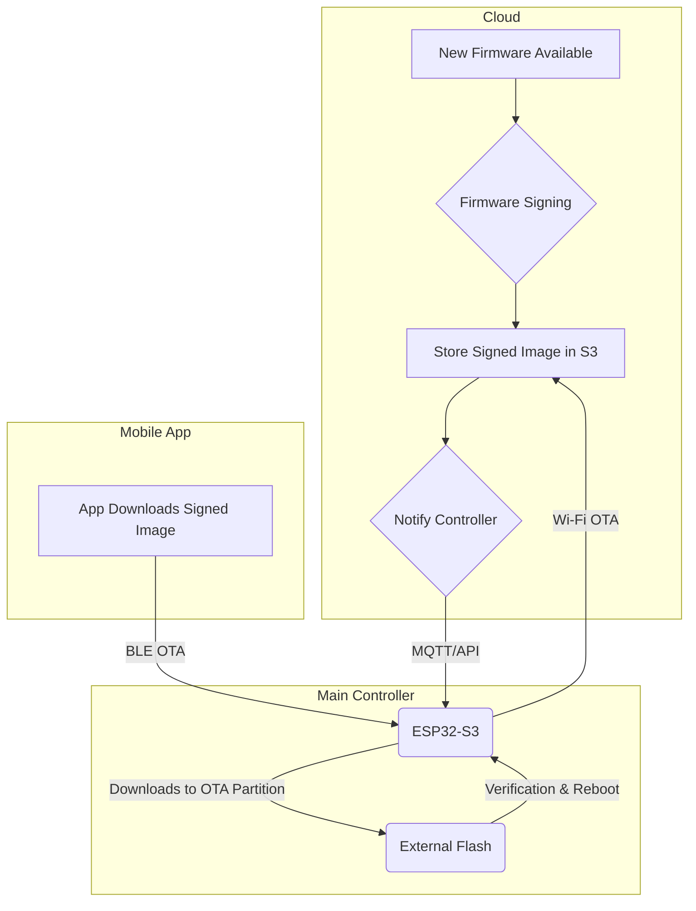

# 4. OTA Firmware Update Architecture

**Scope:** This document defines the architecture and process for delivering Over-the-Air (OTA) firmware updates to deployed Azul hardware (Main Controllers and Zone Extenders). It covers the update delivery mechanisms, security protocols, and fail-safe procedures.

---

## 1. OTA Architecture

### 1.1. Core Principles

-   **Reliability:** The update process must be "bulletproof." It must be able to recover from interruptions (e.g., power loss, connectivity issues) without "bricking" the device.
-   **Security:** Only authenticated and officially signed firmware images can be installed. This is a critical security boundary to prevent malicious actors from taking control of devices.
-   **Efficiency:** Updates should be delivered in a power-efficient manner, especially for the battery-powered Zone Extender.

### 1.2. Update Flow Diagram

---

## 2. Update Delivery Mechanisms

### 2.1. Wi-Fi OTA (Primary Mechanism)

This is the primary method for updating all controllers.

-   **Trigger:** The Azul cloud backend will notify the Main Controller (via MQTT or API poll) that a new firmware version is available.
-   **Process:** The ESP32 firmware will then make an HTTPS request to a secure, pre-signed S3 URL to download the signed firmware binary directly into its designated OTA flash partition.
-   **Applicability:** This is the only mechanism for updating the **Main Controller** and the default mechanism for updating **Zone Extenders** that are within LoRa range of a gateway. The Main Controller will act as a proxy, downloading the Extender firmware and then initiating a BLE OTA session with it.

### 2.2. Bluetooth LE OTA (Manual/Fallback Mechanism)

This method is used for direct, on-site updates and recovery.

-   **Trigger:** A user with appropriate permissions initiates the update from the Azul mobile application.
-   **Process:** The mobile app downloads the signed firmware binary from the cloud. It then connects to the target device (e.g., a Zone Extender in 'Tap-to-Wake' mode) via BLE and transfers the binary using the standardized BLE OTA profile.
-   **Applicability:** This is the primary method for on-site updates of **Zone Extenders** and serves as a fallback recovery mechanism for any device that has lost Wi-Fi connectivity.

### 2.3. LoRa (Explicitly Excluded)

**LoRa will not be used for firmware updates.** The protocol is optimized for small, infrequent packets, not the large, continuous data streams required for a full firmware binary. Attempting to use LoRa for OTA would be extremely slow, power-intensive, and unreliable.

---

## 3. Firmware Image & Security

### 3.1. Image Signing and Verification

This leverages the ESP32-S3's hardware security features.

-   **Signing:** During the automated cloud build process, every official firmware binary will be cryptographically signed using a private key.
-   **Verification:** The ESP32's **Secure Boot** feature will be enabled. The bootloader will contain the corresponding public key. Before booting any application code, the bootloader will use the hardware accelerator to verify the signature of the firmware in the active partition. If the signature is invalid or missing, the boot process will be halted, preventing the execution of unauthorized code.

### 3.2. Versioning and Rollback Protection

-   The firmware will contain an internal version number. The OTA logic will prevent a device from being "downgraded" to an older, potentially less secure version.

---

## 4. Update Process & Fail-Safes

This process leverages the standard ESP-IDF OTA partitioning scheme.

### 4.1. Partition Scheme

The ESP32's flash will be divided into at least three key partitions:
-   `app0` (Factory / Main): The initial, known-good application.
-   `app1` (OTA): The partition where new firmware is downloaded.
-   `otadata`: A tiny partition that acts as a boot manager, pointing to which partition (`app0` or `app1`) should be executed on boot.

### 4.2. Update Handshake and Confirmation

1.  **Download:** The new firmware is downloaded into the *inactive* partition (e.g., if `app0` is active, the download goes to `app1`).
2.  **Verification:** The device verifies the signature of the newly downloaded binary. If valid, it updates the `otadata` partition to point to the new app partition on the next boot.
3.  **Reboot & Test:** The device reboots into the new firmware. The new firmware should run a self-test (e.g., confirm it can connect to Wi-Fi).
4.  **Confirm:** If the self-test passes, the firmware marks the update as "valid." If it fails (or if the device crashes and reboots repeatedly), the bootloader will automatically roll back, booting from the previous, known-good partition.

### 4.3. Power-Loss Recovery

The entire OTA process is designed to be power-fail safe. If power is lost at any point during the download or verification, the `otadata` partition has not yet been changed. On the next boot, the device will simply start from its original, known-good firmware and can attempt the update again later.
