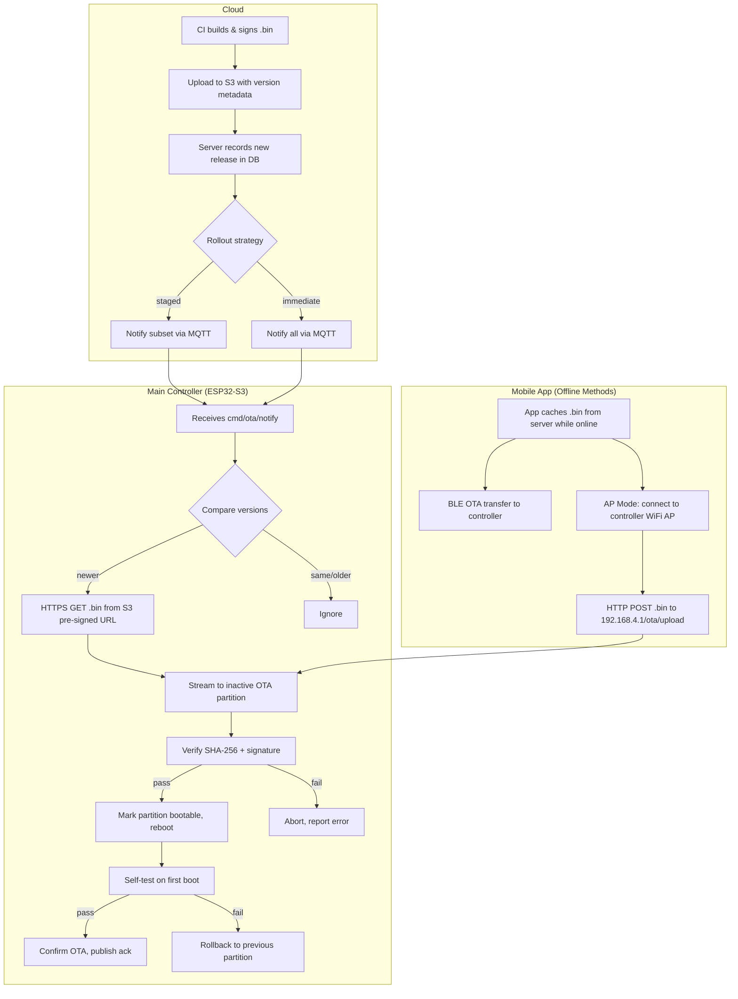

# OTA Firmware Update Architecture

**Scope:** Defines the architecture and process for delivering Over-the-Air (OTA) firmware updates to deployed Azul hardware (Main Controllers and Zone Extenders). Covers delivery mechanisms, MQTT protocol, server infrastructure, partition layout, security, rollout strategy, and fail-safe procedures.

---

## 1. Core Principles

- **Reliability:** Dual-partition A/B scheme — never overwrites the running firmware. Power loss at any point is safe.
- **Security:** Signed firmware images verified on-device before boot. HTTPS transport for downloads.
- **Efficiency:** Streaming download (no full image buffered in RAM). BLE fallback for WiFi-less scenarios.
- **Observability:** Every stage reports progress back to the server so fleet health is always visible.

---

## 2. Update Flow Overview


```mermaid
graph TD
    subgraph Cloud
        A[CI builds & signs .bin] --> B[Upload to S3 with version metadata]
        B --> C[Server records new release in DB]
        C --> D{Rollout strategy}
        D -->|staged| E[Notify subset via MQTT]
        D -->|immediate| F[Notify all via MQTT]
    end

    subgraph "Main Controller (ESP32-S3)"
        G[Receives cmd/ota/notify]
        G --> H{Compare versions}
        H -->|newer| I[HTTPS GET .bin from S3 pre-signed URL]
        H -->|same/older| J[Ignore]
        I --> K[Stream to inactive OTA partition]
        K --> L[Verify SHA-256 + signature]
        L -->|pass| M[Mark partition bootable, reboot]
        L -->|fail| N[Abort, report error]
        M --> O[Self-test on first boot]
        O -->|pass| P[Confirm OTA, publish ack]
        O -->|fail| Q[Rollback to previous partition]
    end

    subgraph "Mobile App (Offline Methods)"
        R[App caches .bin from server while online]
        R --> S[BLE OTA transfer to controller]
        R --> T[AP Mode: connect to controller WiFi AP]
        T --> U[HTTP POST .bin to 192.168.4.1/ota/upload]
    end

    E --> G
    F --> G
    U --> K
```

---

## 3. Flash Partition Table

ESP32-S3 N16R8 has 16 MB flash. Recommended partition layout:

| Partition   | Type    | Offset     | Size    | Notes                        |
|:------------|:--------|:-----------|:--------|:-----------------------------|
| nvs         | data    | 0x9000     | 20 KB   | WiFi creds, config version   |
| otadata     | data    | 0xE000     | 8 KB    | Boot slot selector           |
| app0        | app     | 0x10000    | 6.5 MB  | OTA slot A                   |
| app1        | app     | 0x690000   | 6.5 MB  | OTA slot B                   |
| spiffs      | data    | 0xD10000   | 2.9 MB  | Audit logs, schedule store   |

With 6.5 MB per OTA slot, the firmware has room to grow well beyond the current ~1.5 MB compiled size.

PlatformIO partition CSV (`partitions.csv`):
```csv
# Name,   Type, SubType, Offset,   Size
nvs,      data, nvs,     0x9000,   0x5000
otadata,  data, ota,     0xE000,   0x2000
app0,     app,  ota_0,   0x10000,  0x680000
app1,     app,  ota_1,   0x690000, 0x680000
spiffs,   data, spiffs,  0xD10000, 0x2F0000
```

---

## 4. MQTT Protocol

### 4.1. Server → Device: Update Notification

Topic: `azul/{mac}/cmd/ota/notify`

```json
{
  "version": "0.3.0",
  "url": "https://fw.azul-devices.com/main-controller/0.3.0/firmware.bin",
  "sha256": "a1b2c3d4...",
  "size": 1572864,
  "force": false
}
```

- `url` — pre-signed S3 URL (expires in 1 hour)
- `sha256` — hex digest of the full binary
- `size` — byte count for progress calculation
- `force` — if true, device must update immediately (security patch)

### 4.2. Device → Server: Progress Reports

Topic: `azul/{mac}/events`

```json
{ "type": "ota_progress", "version": "0.3.0", "percent": 45 }
```
```json
{ "type": "ota_complete", "version": "0.3.0", "duration_ms": 28400 }
```
```json
{ "type": "ota_error", "version": "0.3.0", "error": "sha256_mismatch" }
```
```json
{ "type": "ota_rollback", "version": "0.3.0", "reason": "self_test_failed" }
```

### 4.3. Device → Server: Post-Reboot Confirmation

The device's normal status ping (already includes `firmware` field) serves as implicit confirmation. The server compares the reported firmware version against the expected version to confirm success.

---

## 5. Server Infrastructure

### 5.1. Database Schema

```prisma
model FirmwareRelease {
  id          String   @id @default(cuid())
  version     String   @unique
  target      String   // "main-controller" | "zone-extender"
  s3Key       String   @map("s3_key")
  sha256      String
  size        Int
  releaseNotes String?  @map("release_notes")
  createdAt   DateTime @default(now()) @map("created_at")
  rollout     Json?    // { "strategy": "staged", "percent": 10, "started_at": "..." }

  @@map("firmware_releases")
}

model DeviceOtaStatus {
  id          String   @id @default(cuid())
  deviceId    String   @map("device_id")
  version     String
  status      String   // "notified" | "downloading" | "complete" | "error" | "rollback"
  startedAt   DateTime @map("started_at")
  completedAt DateTime? @map("completed_at")
  error       String?
  device      Device   @relation(fields: [deviceId], references: [id])

  @@map("device_ota_status")
}
```

### 5.2. API Endpoints

| Method | Path                          | Purpose                          |
|:-------|:------------------------------|:---------------------------------|
| POST   | /api/admin/firmware/upload    | Upload signed .bin, create release record |
| GET    | /api/admin/firmware/releases  | List all releases                |
| POST   | /api/admin/firmware/rollout   | Trigger rollout (staged or full) |
| GET    | /api/admin/firmware/status    | Fleet OTA status dashboard data  |
| GET    | /api/devices/:mac/ota-status  | Single device OTA history        |

### 5.3. Rollout Strategy

1. **Canary (10%)** — Notify a random 10% of devices. Wait 1 hour.
2. **Staged (50%)** — If no rollbacks reported, expand to 50%. Wait 4 hours.
3. **Full (100%)** — If healthy, push to all remaining devices.
4. **Emergency halt** — Admin can pause rollout at any stage if error rate exceeds threshold.

The server tracks each device's OTA status. If >5% of notified devices report `ota_error` or `ota_rollback`, the rollout auto-pauses and alerts the admin.

---

## 6. Firmware Implementation

### 6.1. OTA Manager Class

```cpp
// OtaManager.h
class OtaManager {
public:
    OtaManager(MqttManager& mqtt);
    void begin();
    void handleNotify(const JsonVariant& data);

private:
    void startDownload(const char* url, const char* sha256, uint32_t size);
    void reportProgress(uint8_t percent);
    void reportError(const char* error);
    void confirmUpdate();

    MqttManager& _mqtt;
    char _pendingVersion[16];
    bool _updating;
};
```

### 6.2. Download and Flash Sequence

```cpp
void OtaManager::startDownload(const char* url, const char* sha256, uint32_t size) {
    _updating = true;

    HTTPClient http;
    http.begin(url);
    int httpCode = http.GET();
    if (httpCode != 200) { reportError("http_failed"); return; }

    WiFiClient* stream = http.getStreamPtr();
    Update.begin(size, U_FLASH);

    uint32_t written = 0;
    uint8_t buf[4096];
    uint8_t lastPercent = 0;

    while (written < size) {
        int bytesRead = stream->readBytes(buf, min((uint32_t)sizeof(buf), size - written));
        if (bytesRead <= 0) { reportError("stream_timeout"); Update.abort(); return; }
        Update.write(buf, bytesRead);
        written += bytesRead;

        uint8_t pct = (written * 100) / size;
        if (pct >= lastPercent + 10) {
            reportProgress(pct);
            lastPercent = pct;
        }
    }

    if (!Update.end(true)) { reportError("write_failed"); return; }

    // SHA-256 verification happens via Update library's MD5/hash mode
    // or manual post-write verification of the inactive partition

    ESP.restart();
}
```

### 6.3. Self-Test and Confirmation

On first boot after OTA, the firmware runs a health check before confirming the update:

```cpp
void OtaManager::confirmUpdate() {
    // If this is the first boot on a new OTA partition:
    if (esp_ota_get_running_partition() != esp_ota_get_last_invalid_partition()) {
        // Run self-test
        bool healthy = WiFi.isConnected() && _mqtt.isConnected();

        if (healthy) {
            esp_ota_mark_app_valid_cancel_rollback();
            // Normal status ping will report new version to server
        } else {
            // Will auto-rollback after esp_ota_check_rollback_is_possible()
            esp_ota_mark_app_invalid_rollback_and_reboot();
        }
    }
}
```

### 6.4. MQTT Command Handler Integration

Add to `MqttManager::handleMessage()`:
```cpp
} else if (strcmp(cmd, "ota/notify") == 0) {
    _otaManager.handleNotify(data);
}
```

---

## 7. AP Mode OTA (Preferred Offline Method)

When the controller has no WiFi connectivity, it can host its own soft AP and receive firmware from the phone over a local HTTP connection. This is significantly faster than BLE and avoids chunking complexity.

### 7.1. Flow

1. User taps "Update Firmware" in mobile app (`.bin` already cached from server)
2. App instructs controller to enter AP mode via BLE command `ota/ap-start`
3. Controller stops station mode, starts soft AP: SSID `Azul-{last4mac}`, WPA2 with device-specific passphrase
4. App prompts user to connect to the controller's WiFi network (or uses iOS/Android WiFi configuration API)
5. Phone connects to controller AP (IP: `192.168.4.1`)
6. App POSTs the `.bin` to `http://192.168.4.1/ota/upload` with `Content-Length` and `X-SHA256` headers
7. Controller streams the upload body directly to the inactive OTA partition (no RAM buffering)
8. Controller verifies SHA-256, responds 200 OK with `{"status": "ok", "rebooting": true}`
9. Controller reboots into new firmware
10. Phone reconnects to normal WiFi

### 7.2. Performance

- Local WiFi throughput: 1-5 MB/s depending on distance
- 1.5 MB firmware: **< 2 seconds** transfer time (plus ~3s for verify + reboot)
- No MTU negotiation, no chunking, no sequence numbers — just plain HTTP

### 7.3. Firmware Implementation

```cpp
// OtaApServer.h — lightweight HTTP server for AP-mode OTA
class OtaApServer {
public:
    void begin();  // Start soft AP + HTTP server on 192.168.4.1:80
    void stop();   // Tear down AP, resume station mode

private:
    WebServer _server;
    void handleUpload();   // POST /ota/upload — streams to Update partition
    void handleStatus();   // GET /ota/status — returns current firmware info
};
```

```cpp
void OtaApServer::begin() {
    WiFi.mode(WIFI_AP);
    // Passphrase derived from MAC — printed on device label
    char ssid[20], pass[16];
    snprintf(ssid, sizeof(ssid), "Azul-%s", WiFi.macAddress().substring(12).c_str());
    snprintf(pass, sizeof(pass), "azul%s", WiFi.macAddress().substring(9).c_str());
    WiFi.softAP(ssid, pass);

    _server.on("/ota/upload", HTTP_POST, [this]() {
        _server.send(200, "application/json", "{\"status\":\"ok\",\"rebooting\":true}");
        delay(500);
        ESP.restart();
    }, [this]() { handleUpload(); });

    _server.on("/ota/status", HTTP_GET, [this]() {
        char buf[128];
        snprintf(buf, sizeof(buf), "{\"firmware\":\"%s\",\"mac\":\"%s\"}",
                 fwVersionFull().c_str(), WiFi.macAddress().c_str());
        _server.send(200, "application/json", buf);
    });

    _server.begin();
}

void OtaApServer::handleUpload() {
    HTTPUpload& upload = _server.upload();
    if (upload.status == UPLOAD_FILE_START) {
        uint32_t size = _server.header("Content-Length").toInt();
        Update.begin(size, U_FLASH);
    } else if (upload.status == UPLOAD_FILE_WRITE) {
        Update.write(upload.buf, upload.currentSize);
    } else if (upload.status == UPLOAD_FILE_END) {
        Update.end(true);
    }
}
```

### 7.4. Captive Portal Mitigation

iOS and Android may drop connections to APs that lack internet. Mitigations:

- Respond to `captive.apple.com` and `connectivitycheck.gstatic.com` with a 204 (signals "has internet")
- On iOS, use `NEHotspotConfiguration` API to join the network programmatically without triggering captive portal detection
- On Android, use `WifiNetworkSpecifier` to bind the app's network to the controller AP

### 7.5. Security Considerations

- WPA2 passphrase derived from MAC address (printed on physical label)
- AP mode only activates when explicitly triggered via BLE command from the device owner
- Auto-timeout: AP shuts down after 5 minutes of inactivity, controller resumes station mode
- SHA-256 verification before marking partition bootable (same as WiFi OTA path)

---

## 8. BLE OTA (Last-Resort Fallback)

For scenarios where AP mode isn't possible (phone cannot switch WiFi, or controller AP hardware failure):

1. Mobile app downloads the `.bin` from `GET /api/admin/firmware/releases/:version/download`
2. User connects to controller via BLE (tap-to-wake or already paired)
3. App sends `ota/start` BLE command with metadata (size, sha256)
4. Controller enters OTA receive mode, acknowledges
5. App streams the binary in 512-byte BLE MTU chunks with sequence numbers
6. Controller writes to inactive OTA partition
7. On completion, controller verifies SHA-256, reboots

With BLE 5.0 DLE (Data Length Extension) + 2M PHY on the ESP32-S3, practical throughput is ~80-200 KB/s. A 1.5 MB firmware takes **8-20 seconds** in good conditions, up to ~75 seconds with conservative BLE 4.2 parameters.

Note: The ESP32-S3 only supports BLE — classic Bluetooth (BR/EDR/SPP) is not available on this chip variant.

---

## 9. Security

### 9.1. Image Signing

- CI pipeline signs every release with an Ed25519 private key (stored in secrets manager)
- Public key baked into bootloader via ESP32 Secure Boot v2
- Bootloader refuses to execute unsigned or tampered images

### 9.2. Transport Security

- S3 URLs are pre-signed with 1-hour expiry — no permanent public URL
- HTTPS (TLS 1.2+) for all downloads
- SHA-256 digest verified post-download before marking partition bootable

### 9.3. Anti-Rollback

- Each firmware carries a monotonic security version counter
- eFuse-based anti-rollback (optional, can be enabled per-device via config)
- Prevents downgrade attacks where an attacker pushes an older, vulnerable firmware

### 9.4. Access Control

- Only admin users can upload firmware or trigger rollouts
- Devices only accept OTA notifications from the MQTT broker they're authenticated to
- BLE OTA requires the device to be in claimed state and the phone to be the owner

---

## 10. Monitoring and Alerting

| Metric                        | Alert Threshold     | Action                    |
|:------------------------------|:--------------------|:--------------------------|
| OTA error rate                | >5% of fleet        | Pause rollout, notify admin |
| Rollback rate                 | >2% of fleet        | Pause rollout, investigate |
| Download duration             | >5 minutes          | Warn (possible slow connection) |
| Devices not reporting post-OTA | >1% after 30 min   | Flag as potentially bricked |
| Firmware version fragmentation | >3 versions active  | Informational — consider forced update |

---

## 11. LoRa (Explicitly Excluded)

LoRa will **not** be used for firmware updates. The protocol is optimized for small, infrequent packets (<256 bytes), not the continuous streaming required for a multi-MB firmware binary. A 1.5 MB image at LoRa data rates would take hours and drain batteries.

---

## 12. Implementation Phases

### Phase 1: Foundation
- Define partition table in `partitions.csv`
- Add `OtaManager` class to firmware
- Add `ota/notify` MQTT command handler
- Implement HTTPS download + Update library flash
- Self-test and rollback logic

### Phase 2: Server Infrastructure
- `FirmwareRelease` and `DeviceOtaStatus` Prisma models + migration
- S3 bucket for firmware binaries
- Upload endpoint (admin-only)
- Rollout trigger endpoint
- OTA status tracking from device events

### Phase 3: Rollout Engine
- Staged rollout logic (canary → staged → full)
- Auto-pause on error threshold
- Admin dashboard for fleet OTA status
- Pre-signed URL generation with expiry

### Phase 4: AP Mode OTA (Offline)
- `OtaApServer` class in firmware (soft AP + HTTP upload endpoint)
- BLE `ota/ap-start` command to trigger AP mode
- Mobile app: cache `.bin` from server, detect available firmware updates
- Mobile app: WiFi switch flow (NEHotspotConfiguration on iOS, WifiNetworkSpecifier on Android)
- Captive portal mitigation (204 responses)
- Auto-timeout (5 min inactivity → resume station mode)
- Progress UI in mobile app

### Phase 5: BLE OTA (Last-Resort Fallback)
- BLE chunked transfer protocol with sequence numbers + retries
- DLE + 2M PHY negotiation for maximum throughput
- Mobile app progress UI for slower transfer

### Phase 6: Security Hardening
- CI signing pipeline (Ed25519)
- ESP32 Secure Boot v2 enablement
- Anti-rollback eFuse configuration
- Penetration testing of all update paths (WiFi, AP, BLE)
