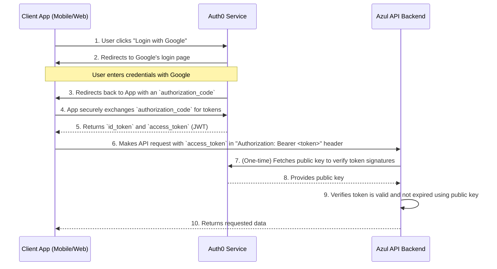

# 5. Security and Authentication Architecture

**Scope:** This document defines the security architecture for the Azul platform, covering user authentication (identity verification), authorization (access control), and API security.

---

## 1. Executive Recommendation: Delegate to an Identity Provider (Auth0)

The definitive architectural decision for user authentication is to **delegate** this critical and high-risk function to a specialized, third-party Identity-as-a-Service (IDaaS) provider. The recommended provider is **Auth0**.

### 1.1. Justification
-   **Risk Mitigation:** We will **never build our own authentication system**. The complexity of securely handling user credentials, password hashing, storage, resets, and multi-factor authentication (MFA) represents an unacceptable business risk.
-   **Comprehensive Feature Set:** Auth0 provides pre-built, secure, and maintained integrations for all required login methods, which can be enabled via a dashboard:
    -   **Social Logins:** "Login with Google," "Login with Apple," etc., using OAuth 2.0.
    -   **Enterprise Federation:** SAML/SSO for large landscaping businesses to integrate with their corporate identity systems (e.g., Okta, Azure AD).
-   **Security & Compliance:** Auth0 provides world-class security, handling brute-force protection, breached password detection, and compliance with standards like GDPR and CCPA.

---

## 2. Alternative Providers Considered: Okta

The primary alternative considered was **Okta**. Okta is an enterprise-grade identity management leader. However, for the specific needs and development stage of the Azul project, Auth0 is the superior choice.

### 2.1. Why Auth0 is Better for Azul

-   **Developer-Centric vs. Enterprise-Centric:** Auth0 was built from the ground up for developers to integrate into new applications. Its APIs, documentation, and SDKs are widely regarded as more flexible and easier to work with for a greenfield project. Okta's primary focus is on providing a centralized identity solution for large enterprises to manage their employees and existing application portfolios.
-   **More Generous Free Tier:** Auth0's free tier, with its high limit of 25,000 MAUs, is significantly more generous and better suited for a new product launch than Okta's typical offerings. This provides a much longer runway for development and initial growth before incurring costs.
-   **B2B "Organizations" Feature:** Auth0's "Organizations" feature is a purpose-built tool for the exact multi-tenant B2B scenario required by our landscaper use case. While Okta can achieve this, it often requires more complex configuration and a higher-tier plan.
-   **Startup Program:** Auth0 has a well-established and highly regarded startup program that provides access to professional-tier features for free, making it exceptionally friendly to new ventures.

**Conclusion:** While Okta is a powerful and respected platform, Auth0's developer-first approach, superior free tier, and startup-friendly programs make it the clear architectural choice for accelerating development and minimizing initial operational costs for the Azul project.

---

## 3. Authentication Flow: OAuth 2.0 & OpenID Connect (OIDC)

The system will use a standard, token-based authentication flow. The Azul API backend remains **stateless** and never directly handles user passwords.



### 3.1. Key Components

-   **JSON Web Token (JWT):** The `access_token` is a digitally signed JWT. It is an unforgeable "ticket" that the client app includes with every API request. It contains claims such as the `user_id` (`sub` claim) and has a short expiration time (e.g., 1-24 hours).
-   **Stateless API:** The API Gateway and Lambda functions will validate the JWT on every incoming request. This is done by checking the token's digital signature against Auth0's published public key. If the signature is valid and the token is not expired, the request is trusted.

---

## 4. Authorization: Access Control

Once a user is *authenticated* (we know who they are), authorization determines what they are allowed to *do*.

-   **Role-Based Access Control (RBAC):** The user's role (e.g., `homeowner`, `landscaper`) will be included as a custom claim in the JWT provided by Auth0.
-   **Data-Layer Enforcement:** The API backend will use the `user_id` and `role` from the validated JWT to make database queries that enforce access rules.
-   **Example Query Logic (`GET /properties/{property_id}`):**
    1.  Extract `user_id` from the JWT.
    2.  Execute a SQL query:
        ```sql
        SELECT * FROM properties 
        WHERE property_id = :property_id 
        AND (
            owner_id = :user_id 
            OR EXISTS (
                SELECT 1 FROM property_managers 
                WHERE property_id = :property_id AND manager_id = :user_id
            )
        );
        ```
    3.  If the query returns a row, the user is authorized, and the data is returned.
    4.  If the query returns no rows, the API returns a `403 Forbidden` error, because the authenticated user does not have the required relationship to the data.

---

## 5. Implementation & Staging Strategy

The choice of Auth0 enables a cost-effective and phased implementation strategy.

-   **Phase 1 (Development & Launch): Use the Free Tier.** Auth0's Free Tier is highly generous, supporting up to 25,000 Monthly Active Users (MAUs) and all essential features, including social logins. This allows the entire Azul platform to be developed and launched with zero initial cost for authentication infrastructure.

-   **Phase 2 (Scale): Plan for Paid B2B Tier.** As the platform grows and the landscaper use case becomes a primary revenue driver, we will migrate to a paid Auth0 B2B plan. This is necessary to access critical B2B features at scale, most notably **"Organizations,"** which provides the multi-tenant framework required for landscapers to manage their clients securely.

-   **Action Item:** The business should investigate the **Auth0 for Startups** program, which may provide access to professional-tier features for free for the first year, further reducing initial operating costs.
