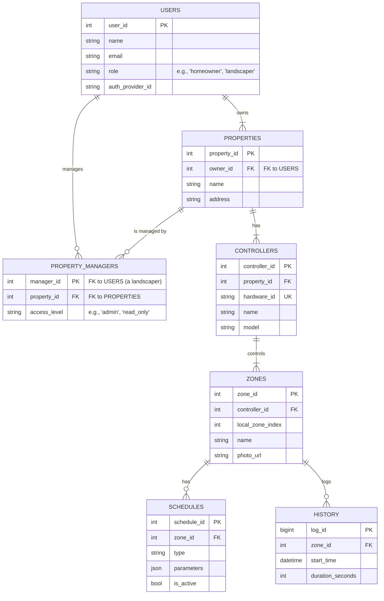

# 1. System Data Architecture

**Scope:** This document defines the comprehensive data and state management strategy for the entire Azul ecosystem. It covers the flow of data between the cloud, the controllers, and the mobile clients, establishing the "source of truth" and data persistence models for each component.

---

## 1. System Data Architecture

### 1.1. Architectural Decision: A Hybrid Source of Truth

The Azul system implements a hybrid data authority model to ensure resilience, accessibility, and scalability.

-   **Cloud Database (The Source of Truth):** The cloud database is the master record for all user accounts, controller configurations, zone definitions, and schedules. All changes initiated by a client application are written first and foremost to the cloud via a secure API. This guarantees that user intent and configuration are never lost.

-   **Controller (The Operational Authority):** The controller acts as the operational authority. It maintains a full local copy of its own configuration and schedules, stored persistently in its onboard flash memory. This allows it to operate fully autonomously, running its last known good schedule even if its internet connection is lost. Its primary loop is to execute locally stored schedules while listening for updates or commands from the cloud.

### 1.2. Data Flow Model
1.  **User Action:** User modifies a schedule in the mobile app.
2.  **Cloud Update:** The mobile app sends the updated schedule to the backend API, which saves it to the master database.
3.  **Command Queuing:** The backend sends a "new schedule available" command to the target controller via its real-time communication channel (e.g., MQTT).
4.  **Device Sync:** The controller receives the command, downloads the new schedule from the API, validates it, and overwrites its local copy in flash memory.
5.  **State Reporting:** The controller reports its operational status (e.g., "zone 1 on," "zone 1 off") back to the cloud, which stores this as historical data.

---

## 2. On-Device State Management (ESP32)

### 2.1. Onboard Storage Strategy

-   **Non-Volatile Storage (NVS):** Used for storing structured configuration data, such as settings and zone definitions. NVS is a key-value store optimized for frequent, small writes.
-   **SPIFFS/LittleFS:** A small filesystem in the flash memory used for storing larger, unstructured files. For Azul, this will primarily be used for zone photos.

### 2.2. Core Data Structures (Conceptual)

The on-device data will be managed using structs, which are then serialized for storage.

```cpp
// Stored in NVS under a key like "config"
struct ControllerState {
  char controller_name[32];
  bool is_adopted;
  char master_guid[38];
  uint8_t num_zones;
  // etc...
};

// Stored in NVS under keys like "zone_0", "zone_1", etc.
struct Zone {
  uint8_t id;
  char description[64];
  bool is_enabled;
  char photo_filename[32]; // e.g., "zone_0.jpg"
  // ...plus all schedule data...
};

// The actual image file (e.g., zone_0.jpg) is stored separately in SPIFFS.
```

---

## 3. Cloud Data Model (Normalized for B2B)

This section defines the logical structure of the data, normalized to support a many-to-many relationship between Landscapers (Users) and the Properties they manage.

### 3.1. Entity-Relationship Diagram (ERD)



### 3.2. Entities and Attributes

-   **USERS**
    -   Represents a single user account. The `role` attribute distinguishes between a standard 'homeowner' and a 'landscaper' (a small business owner).
    -   `user_id`: Primary Key.
    -   `role`: Defines the user's capabilities in the system.

-   **PROPERTIES**
    -   Represents a physical location.
    -   `owner_id`: A **mandatory** foreign key to the `USERS` table. Every property has exactly one owner (the client).

-   **PROPERTY_MANAGERS (Join Table)**
    -   This is the core of the normalized model. It creates a many-to-many relationship between `USERS` (specifically those with the 'landscaper' role) and `PROPERTIES`.
    -   `manager_id`: Foreign key to `USERS`. This is the ID of the landscaper.
    -   `property_id`: Foreign key to `PROPERTIES`. This is the ID of the property being managed.
    -   `access_level`: Defines what the manager can do (e.g., 'admin' for full control).
    -   **Example Query:** To find all properties a landscaper can manage: `SELECT * FROM PROPERTIES WHERE property_id IN (SELECT property_id FROM PROPERTY_MANAGERS WHERE manager_id = 'current_landscaper_id')`.

-   **CONTROLLERS, ZONES, SCHEDULES, HISTORY**
    -   These entities remain largely the same, but their access is now governed by the relationships defined above. A user can only access a controller if they either **own** the parent property OR are listed as a **manager** for that property in the `PROPERTY_MANAGERS` table.

---

## 4. Bluetooth LE State Synchronization

### 4.1. BLE Service Architecture

To prevent slow and inefficient one-to-one mapping of data properties to BLE characteristics, the system will use a service-oriented, API-like approach.

-   **Azul Configuration Service (`UUID: ...-config-service`)**
    -   **Master State Characteristic (Read-Only):** On connection, the client's first action is to read this characteristic. The ESP32 firmware will serialize its entire current state (both `ControllerState` and all `Zone` objects) into a single JSON string and send it to the client. This provides the client with all the data needed to populate its UI in a single, efficient transaction.
    -   **Command Characteristic (Write-Only):** To modify the device state, the client writes small, specific JSON command objects to this characteristic.

### 4.2. Characteristic API & JSON Payloads (Examples)

The firmware will parse these incoming JSON commands to take action.

-   **Command to manually run Zone 3 for 10 minutes:**
    `{ "cmd": "manual_run", "zone_id": 3, "duration": 10 }`

-   **Command to update the description for Zone 1:**
    `{ "cmd": "update_zone", "zone_id": 1, "data": { "description": "Front lawn roses" } }`

-   **Command to update a schedule:**
    `{ "cmd": "update_schedule", "zone_id": 1, "data": { ...schedule object... } }`
