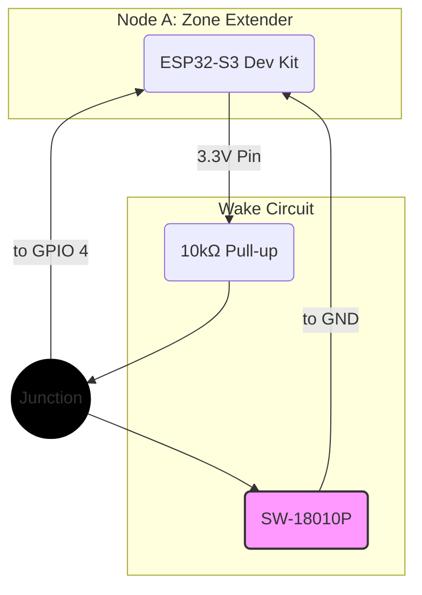

# Milestone 3: Tap-to-Wake

### Objective
Validate the Zone Extender's v2 core power-saving strategy: entering an ultra-low-power deep sleep state and waking reliably via an external hardware interrupt.

### Key Steps
- ⚪ Wire the vibration sensor switch to `GPIO 4`.
- ⚪ Use a 10kΩ resistor to pull `GPIO 4` HIGH to 3.3V.
- ⚪ Write and flash firmware to configure `GPIO 4` as an EXT0 wake-up source.
- ⚪ In the `setup()` function, blink an LED, then immediately command the device to enter `deep_sleep()`.

### Verification
- ⚪ The board boots, blinks the LED, and then enters a low-power state.
- ⚪ A firm tap on the vibration sensor causes the board to instantly wake, boot, and blink the LED again before re-entering sleep.

---

### Detailed Instructions

This test should be performed on **Node A (Zone Extender)**.

- ⚪ **1. Create a New Project:**
    - ⚪ Create a new PlatformIO project named `PoC-Tap-To-Wake`.

- ⚪ **2. Wire the Components:**
    - ⚪ **Vibration Switch:** Connect one leg to `GPIO 4` and the other leg to the `GND` rail.
    - ⚪ **Pull-up Resistor:** Connect a 10kΩ resistor between the `3.3V` rail and `GPIO 4`.

- ⚪ **3. Write the Deep Sleep Code:**
    - ⚪ Open `src/main.cpp` and replace the contents with the provided code.

    ```cpp
    #include <Arduino.h>

    #define ONBOARD_LED 48
    #define WAKE_PIN GPIO_NUM_4

    RTC_DATA_ATTR int bootCount = 0;

    void setup() {
      Serial.begin(115200);
      delay(1000); 

      bootCount++;
      Serial.println("Boot number: " + String(bootCount));

      pinMode(ONBOARD_LED, OUTPUT);
      for (int i = 0; i < 3; i++) {
        digitalWrite(ONBOARD_LED, HIGH);
        delay(100);
        digitalWrite(ONBOARD_LED, LOW);
        delay(100);
      }

      Serial.println("Configuring wake-up source and entering deep sleep...");
      esp_sleep_enable_ext0_wakeup(WAKE_PIN, 0); 
      esp_deep_sleep_start();
    }

    void loop() {
      // This will never be reached.
    }
    ```

- ⚪ **4. Upload and Test:**
    - ⚪ Click the **"Upload and Monitor"** button.
    - ⚪ **Verification:** The Serial Monitor shows "Boot number: 1", the LED blinks, and then messages stop.
    - ⚪ Firmly tap the vibration sensor.
    - ⚪ **Verification:** The board wakes, the Serial Monitor shows "Boot number: 2", and the LED blinks again before it returns to sleep.

### Wiring Diagram

